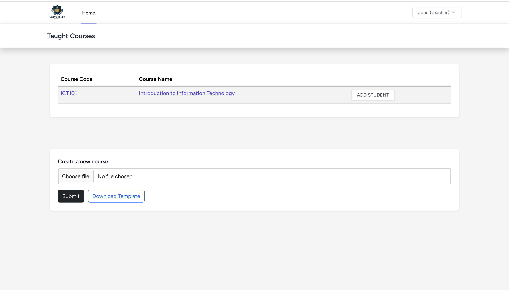

# 📚 Student Peer Review System

A comprehensive Laravel-based web application designed for educational institutions to facilitate peer review processes between students. This system enables teachers to create courses, manage assessments, and students to submit and review each other's work in a structured, organized manner.

## 📸 Application Screenshots

### Teacher Dashboard
*Screenshot of the main teacher dashboard showing course overview and statistics*


### Student Dashboard  
*Screenshot of the student view showing enrolled courses and pending reviews*


### Assessment Creation
*Screenshot of the assessment creation form for teachers*


### Peer Review Interface
*Screenshot of the peer review submission interface*


### Review Ratings & Feedback
*Screenshots showing the review rating system and feedback interface*


*Student rating a received review*


*Review with completed rating and feedback*

## ✨ Features

### 👨‍🏫 For Teachers
- **Course Management**: Create and manage courses with automatic enrollment
- **Assessment Creation**: Design peer review assessments with customizable parameters
- **Bulk Course Creation**: Upload multiple courses via JSON template files
- **Student Management**: Add students to courses and monitor their progress
- **Grading System**: Assign scores to students based on their peer review participation
- **Progress Tracking**: Monitor student review completion and quality
- **Teacher Dashboard**: Overview of all taught courses and assessment statistics

### 👨‍🎓 For Students
- **Course Enrollment**: Automatic enrollment in assigned courses
- **Peer Review Submission**: Submit reviews for assigned or selected peers
- **Review Management**: View received reviews and provide feedback ratings
- **Score Tracking**: Monitor personal scores across different assessments
- **Assessment Dashboard**: Clear overview of all course assessments and deadlines
- **Interactive Feedback**: Rate and provide feedback on received reviews

### 🔄 Review System
- **Two Review Types**:
  - **Student-Select**: Students choose their own reviewees
  - **Teacher-Assign**: Teachers assign specific review partnerships
- **Rating System**: 1-5 star rating system for review quality
- **Score Assignment**: Reviewers can assign scores (0-100) to reviewees
- **Feedback Loop**: Students can provide feedback on reviews they receive
- **Review Tracking**: Complete audit trail of all review activities

## 🏗️ Architecture

### Technology Stack
- **Backend**: Laravel 11 (PHP)
- **Frontend**: Blade Templates with Tailwind CSS
- **Database**: SQLite (easily configurable to other databases)
- **Authentication**: Laravel Breeze
- **UI Framework**: Bootstrap 5 + Tailwind CSS
- **File Processing**: JSON template system for bulk operations


## 🚀 Installation & Deployment

### 🐳 Docker Deployment (Recommended)

This project is fully configured for Docker deployment. Simply clone and run:

```bash
# Clone the repository
git clone https://github.com/mengning-li/Student-peer-review.git
cd Student-peer-review

# Build and start the containers
docker-compose up -d

# Access the application
open http://localhost:8000
```

The Docker setup includes:
- **PHP 8.2 with Apache** (Application server)
- **Redis** (Caching and sessions)
- **SQLite** (Lightweight database)
- **Nginx** (Optional reverse proxy - disabled by default)

## 🧪 Test Data & Demo Accounts

### 🎲 **Generating Sample Data**

To populate your database with test data for demonstration and development:

```bash
# Enter the application container
docker exec -it student-peer-review-app bash

# Reset database and populate with test data
php artisan migrate:fresh --seed --force

# Or if you want to add data to existing database
php artisan db:seed --force
```

**Note**: The `--force` flag is needed because the app is in production mode in Docker.

### 👥 Pre-configured Demo Accounts

After running the seeders, you'll have access to these test accounts (Password: `12341234` for all):

#### 🎓 **Demo Students** 
| sNumber | Name | Enrolled Courses | Best For |
|---------|------|------------------|----------|
| **s111111** | **Bob** | ICT101, ICT102, ICT201 | **Primary demo account** |
| s222222 | Fred | ICT101, ICT102 | Student collaboration |
| s333333 | Tony | ICT101 | Basic student view |
| s444444 | Jim | ICT101 | Review interactions |

#### 🎓 **Factory Students** (Advanced Demo)
| sNumber | Name | Courses | Reviews | Best For |
|---------|------|---------|---------|----------|
| **s320536** | **Jess Buckridge IV** | 4 courses | 11 reviews | **Rich data demo** |
| s412316 | Sebastian Hill | 4 courses | 9 reviews | Scale demonstration |

#### 👨‍🏫 **Teachers** 
| sNumber | Name | Role |
|---------|------|------|
| **s555555** | **John** | Teacher |

### 📊 Generated Sample Data

The seeder creates:
- **📚 20 Courses** - Demo + factory generated courses
- **📝 55+ Assessments** - Various peer review assignments
- **👥 113 Users** - Mix of demo and factory accounts
- **📋 244+ Enrollments** - Realistic course enrollments
- **⭐ 367+ Reviews** - Meaningful peer reviews with proper relationships

### 🔧 Resetting Test Data

To start fresh with clean test data:

```bash
# Enter container
docker exec -it student-peer-review-app bash

# Reset database and reseed
php artisan migrate:fresh --seed
```

**📸 Test Data Screenshots:**

*Screenshot showing login with demo account*


*Screenshot of courses populated with test data*

## 📁 Project Structure

```
Laravel/
├── app/
│   ├── Http/Controllers/     # Route controllers
│   ├── Models/              # Eloquent models
│   └── ...
├── database/
│   ├── migrations/          # Database schema
│   ├── seeders/            # Sample data
│   └── factories/          # Model factories
├── resources/
│   ├── views/              # Blade templates
│   ├── css/                # Stylesheets
│   └── js/                 # JavaScript files
├── routes/
│   └── web.php             # Web routes
└── public/
    └── templates/          # JSON template files
```


## 📝 License

This project is open-sourced software licensed under the [MIT license](https://opensource.org/licenses/MIT).

